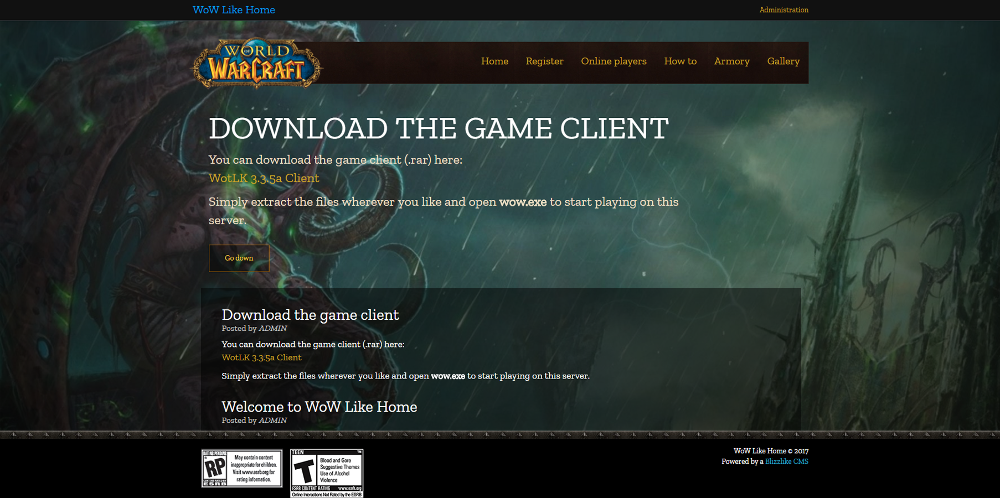

<h3>Welcome to the repository for my try on a CMS for the TrinityCore Open Source MMO Framework.</h3>
This is focused on being easy to setup and use for your own private server.

You can also join us on Discord if you need any help or have any other requests: https://discord.gg/Y9TTaNk

**FEATURES** 
- Account creation page
- Easy to use and install
- A see who's online list that displays the players username, race, level and faction
- A "how to connect" page for the advantage of the users of the server
- Character search (Unfinished "armory")
- Server status
- CMS for editing posts/news on the website
- Administration panel for editing server accounts without using the console
- Gallery

**SETUP**

**Before you continure to read I would like to mention that I have made a video tutorial (for Linux/Ubuntu 18.04) so far, so you might want to check it out as it might help you out of some tricky situations:**
https://www.youtube.com/watch?v=1h0Cpr5Osg4

**The video(s) doesn't mean that you shouldn't read the material underneath, as it explains you more about how to edit the theme/appearance.**

Simply import all the files into your desired website root folder, then open the site in your browser and follow the installation. Make sure you have **permission** to write to includes/config.php

For security reasons, remember to **delete both install.php** files after the installation is complete*

In order to log in to the administration panel, use the same credentials as your server accounts with admin rights.

**If you are going to edit the stylesheet/javascript files you are going to need <a href="https://nodejs.org">Node.js</a> installed as this project comes with watcher/sass scripts.**

**First setup Node by running the command "npm install". Then you can run "npm run watch" to start using the watcher. Now you can edit the CSS and JS files located in the /src folder.**

**PS: This is still a work in progress, but I will try to update the project frequently.**

**Preview of the Legion theme**
